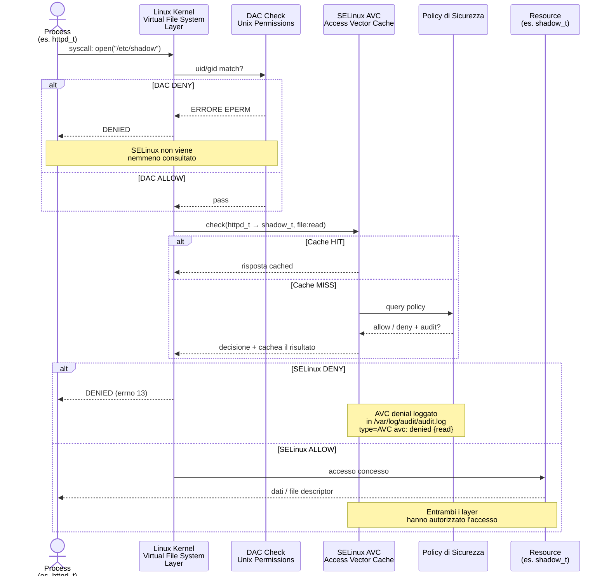

# Markdown

<!-- New section -->

## Introduction

SELinux (_Security Enhanced Linux_) è un sistema di _controllo degli accessi obbligatorio_ costruito sull'interfaccia LSM (_Linux Security Modules_) di Linux.

In pratica, **il kernel interroga SELinux prima di ogni chiamata di sistema per sapere se il processo è autorizzato ad eseguire una data operazione**.

<!-- New subsection-->
### Controllo di accesso

Un **kernel** Linux che integra SELinux impone politiche di **Controllo di accesso** obbligatorie *che limitano i programmi degli utenti*, i software di sistema dei server, l'accesso ai file e alle risorse di rete. **Limitando i permessi al minimo**, sui sistemi Linux, si riduce la possibilità di fare danni se programmi risultano difettosi o compromessi. 
<!-- .element: class="fragment" -->
Questo concetto è anche noto come [Principle of Least Privilege](https://en.wikipedia.org/wiki/Principle_of_least_privilege). 

<!-- New subsection-->
### Discretionary Access Control
La sicurezza di un sistema senza SELinux (**Discretionary Access Control**) dipende dalla correttezza del kernel, da tutti i privilegi delle applicazioni e da ogni loro configurazione. Ad esempio, la ROOT ha accesso a tutto e può fare quel che vuole. I permessi legati agli utenti e ai gruppi determinano chi ha accesso a cosa. 

<!-- New subsection-->
### Mandatory Access Control
Al contrario in un sistema che integra SELinux (**Mandatory Access Control**), la sicurezza dipende dalla correttezza del kernel e dalle configurazioni delle politiche (o *policy*) di sicurezza.
<!-- .element: class="fragment" -->
Solo con permessi root si possono modificare le policy di sicurezza. SELinux protegge dalla compromissione di processi non privilegiati. Non protegge da un attaccante che ha già ottenuto root.
<!-- .element: class="fragment" -->
Quindi il tipo di difesa che otteniamo con SELinux è una prevenzione: **cerchiamo di limitare Privilege Escalation a monte.** 

<!-- New section -->

## Policies e Moduli
**Una policy è formata da più moduli**. Ogni modulo è una unità di regole che copre un dominio. 
<!-- .element: class="fragment" -->
**TIPO = Assegnato ad un oggetto, DOMINIO = Assegnato ad un processo in esecuzione.** La policy SELinux è un insieme di regole che dicono quali domini possono interagire con quali tipi, e in che modo. 

<!-- New subsection-->
### Aggiunta e Rimozione di policies
**Aggiungere moduli ad una [[policy]] è semplice**, anche tramite cose che sono state bloccate precedentemente, tramite `audit2why` e `audit2allow`.
<!-- .element: class="fragment" -->
Tuttavia bisogna esercitare cautela nella **rimozione di un modulo**, perché potrebbe comportare policies con fallacie o policy inconsistenti.

<!-- New section-->
## Labeling, Contesti, Domini
Il mapping tra i file di un File System e i contesti di sicurezza è chiamato **etichettatura** o **labeling**.
<!-- .element: class="fragment" -->
All'accesso, **all'utente viene assegnato un contesto di sicurezza predefinito** (a seconda dei ruoli che dovrebbe essere in grado di assumere). Questo definisce il dominio corrente, e di conseguenza il dominio che tutti i suoi processi figli acquisiranno. 

<!-- New subsection-->
### Extra sul dominio utente
Se si vuole variare il ruolo corrente e il suo dominio associato, si deve eseguire `newrole -r ruolo_r -t dominio_t` 
<!-- .element: class="fragment" -->
Questo comando autentica l'utente richiedendo l'inserimento della **Password**. Questa caratteristica impedisce ai programmi di cambiare automaticamente i ruoli. Tali cambiamenti possono avvenire solo se esplicitamente ammessi nella **Policy** attualmente caricata SELinux. 

<!-- New subsection-->
### Ereditarietà Domini
Per impostazione predefinita, un **programma eredita il relativo dominio dall'utente che lo ha eseguito**, ma la politica standard di SELinux si aspetta che i programmi più importanti vengano eseguiti in domini dedicati. 
<!-- .element: class="fragment" -->
Per ottenere ciò, questi eseguibili sono etichettati con un tipo univoco (per esempio `ssh` è etichettato come `ssh_exec_t`, e quando il programma parte, automaticamente passa al dominio `ssh_t`). Questo meccanismo automatico di transizione di dominio permette di concedere esclusivamente i diritti richiesti da ciascun programma.

<!-- New section-->
## Access Vector Cache
La **Access Vector Cache** (o AVC) permette a SELinux di non creare immenso **Overhead** nel momento di fare chiamate di sistema, e aiuta nel non consultare costantemente l'intera policy ad ogni syscall. La cache di decisioni già prese viene caricata in memoria così da fungere, appunto, da meccanismo di cache. 
<!-- .element: class="fragment" -->
`(dominio_sorgente, tipo_destinazione, classe_oggetto)` - Viene utilizzata una bitmask per rappresentare tutti i permessi possibili. 
<!-- .element: class="fragment" -->
Viene svuotata quando si carica un nuovo modulo, si cambia un booleano o la modalità. 

<!-- New section-->
## Diagramma di Flusso di Funzionamento SELinux

